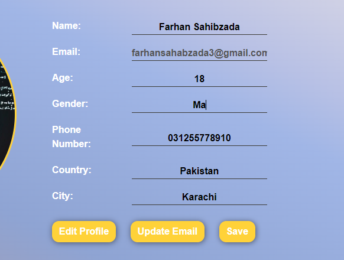
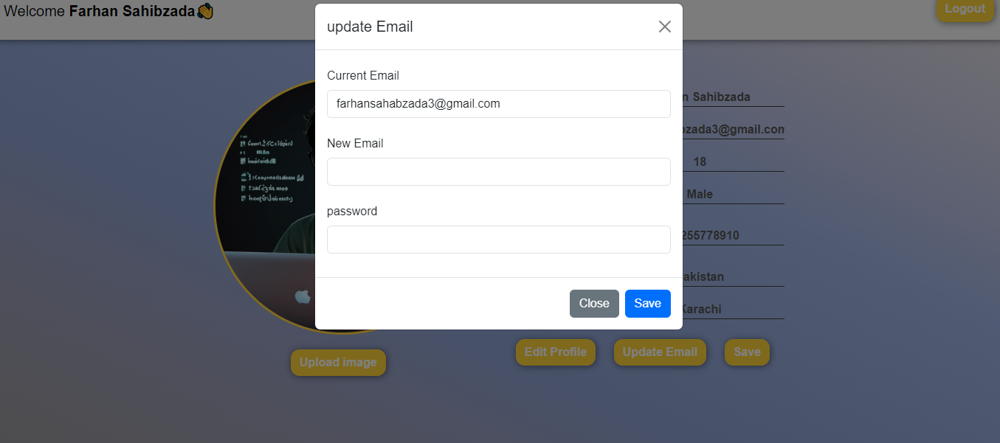

# 🚀 Advanced Authentication and Profile Management 🚀

## Welcome to the Advanced Authentication and Profile Management System!

This project features a comprehensive sign-up and login system built with HTML, CSS, JavaScript, and Firebase. It offers users the ability to create and manage their profiles, including setting profile images, updating personal details, and editing their email addresses.

### Screenshot:

### Features:

- **User Registration and Login**: Secure and straightforward authentication using Firebase.

- **Profile Customization**: Users can:
  - Set and update profile images

  - Add and modify personal details

  - Change their email address
  - 
- **Secure Logout**: Easy and secure logout functionality.
- **Responsive Design**: Ensures a seamless experience across desktops, tablets, and smartphones.

### Technologies Used:

- **HTML5**: For structuring the user interface.
- **CSS3**: For styling and responsive design.
- **JavaScript**: For interactivity and handling Firebase operations.
- **Firebase**: For authentication and  database management.

### Live Demo

Explore the live demo of the authentication and profile management system [here](https://your-live-demo-link.com).

### Contact

For any questions or feedback, feel free to reach out to me:

- **Name**: [Farhan Sahibzada]
- **Email**: [farhansahabzada3@gmail.com]
- **GitHub**: [https://github.com/Farhan Sahibzada](https://github.com/Farhan Sahibzada)
